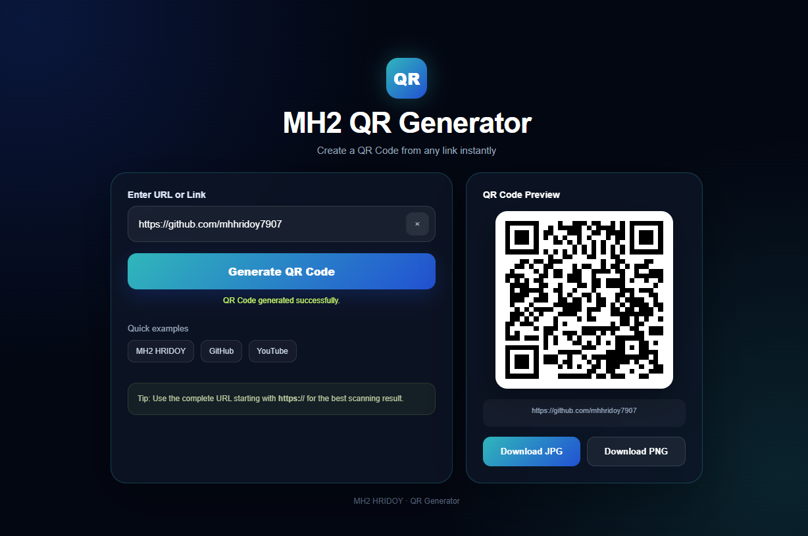

# MH2 QR Generator

A modern, responsive QR Code Generator built with **HTML, CSS, and JavaScript**.

Create QR codes from any URL instantly and download them as **PNG or JPG** images.

## ✨ Features

* 🔗 Generate QR codes from any URL
* ⚡ Instant QR code generation
* 📱 Mobile-friendly responsive design
* 💻 PC and desktop friendly
* 🧹 Clear/reset input easily
* 🚀 Quick example links
* 🖼️ Download QR code as PNG
* 📸 Download QR code as JPG
* 🔒 High QR error correction
* 🎨 Modern dark glassmorphism UI
* 🌐 Works directly in the browser
* 📦 No build tools required

## 🛠️ Technologies

* HTML5
* CSS3
* JavaScript
* QRCode.js
* Canvas API

## 🚀 How to Use

1. Enter a URL in the input field.
2. Click **Generate QR Code**.
3. Your QR code will appear in the preview section.
4. Download it as **PNG** or **JPG**.

The application also automatically adds `https://` when a URL is entered without a protocol.


## 📸 Screenshot



## 📁 Project Structure

```text
MH2-QR-Generator/
code/
│    ├── index.html
│    ├── style.css
│    └── script.js
├── LICENSE
└── README.md
```

## 🔗 Quick Examples

The application includes quick examples for:

* MH2 HRIDOY Portfolio
* GitHub
* YouTube

## 🎨 Design

The interface uses a modern dark theme with:

* Cyan and blue gradients
* Glassmorphism cards
* Responsive layouts
* Mobile-friendly controls
* Clean QR preview area

## 📸 QR Downloads

Generated QR codes can be exported in:

* PNG
* JPG

The downloaded file uses the format:

```text
MH2-QR-Code.png
MH2-QR-Code.jpg
```

## 🌐 Live Demo

**MH2 QR Generator:**
https://mh2-hridoy.web.app/

## 👨‍💻 Author

**MH2 HRIDOY**

* GitHub: https://github.com/mhhridoy7907
* Portfolio: https://mh2-hridoy.web.app/

## 📄 License

This project is available for personal and educational use.
